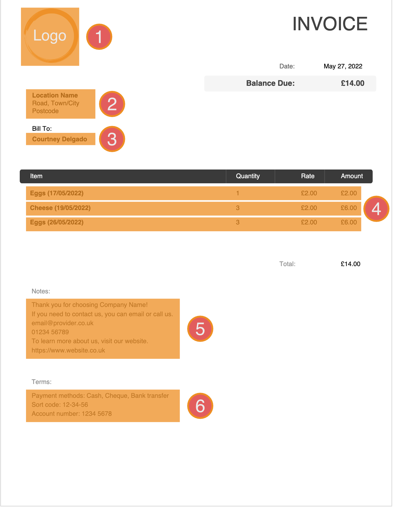

# PDF Invoice Generator
[](https://www.python.org/)

Disclaimer: all information used in testing for this project is fictitious.

Creates an invoice pdf using user-specified data to fill-out the required fields.


---

## Setup

Install the virtualenv library and create the virtual environment with the following commands

```bash
# Download and install virtualenv library
pip install virtualenv
# Create a virtual environment
virtualenv .venv
```

Initialise the virtual environment and download/install the required libraries

```bash

# Initialise virtual environment
# WINDOWS
.venv\Scripts\activate.bat
# MAC OSX
source .venv/bin/activate

# Install required libraries
pip install -r requirements.txt
```

 [](https://asciinema.org/a/NRrfL6C1xtkX74Bp0en9i2g7r)


To test the project, run the following command

```bash
# Run unit tests
python -m unittest test.py
```

[](https://asciinema.org/a/oOQ8NaUn5didSNA14RVboKvsV)

You need to ensure that there's a folder called "images" in your working directory and this folder contains your choice of logo in png format called "logo.png".

Finally you need to ensure you modify the following four text files to correspond with the constant information within your invoices.
```
address.txt
logo_url.txt
notes.txt
payment_terms.txt
```

---

## Invoice Requirements



|Feature|File name|
|---|---|
|Business Logo | logo.png |
|Business Address | address.txt|
|Customer Name | N/A |
|Order Items | N/A |
|Notes (Extra information) | notes.txt|
|Payment / Term Information | terms.txt|

We want to store `logo.png` in the images folder. This image will be automatically compressed and saved to a new file called `main_logo.png`. This is to reduce the generation time of each pdf file.

We want three files with text for the address`(2)`, notes`(5)` and terms`(6)` of the invoice.

## TODO List

- Downsize logo image whilst maintaining proportions

<!-- Convert asciinema terminal videos to gif -->
<!-- https://dstein64.github.io/gifcast/ -->